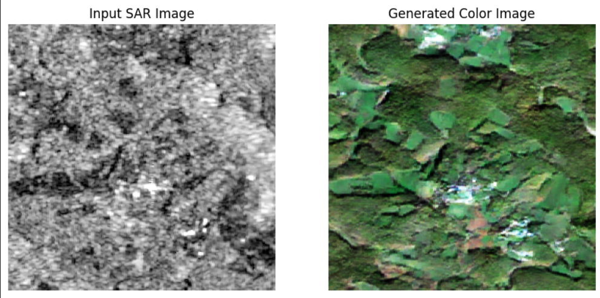

# SAR-to-RGB Image Translation using GANs

A Generative Adversarial Network (GAN) implementation for translating Synthetic Aperture Radar (SAR) images to RGB visual representations.

## Features

- U-Net based Generator architecture with skip connections
- PatchGAN Discriminator for detailed local evaluation
- Custom Chromatic Aberration Loss combining:
  - Perceptual loss using VGG19 features
  - Spatial consistency loss
  - Edge-aware loss
- Mixed-precision training support
- GPU acceleration with CUDA

## Installation

1. Clone the repository:

git clone https://github.com/CodeExplorer0/SAR_image_recolorisation.git

cd SAR_image_recolorisation

2. Install dependencies:

pip install torch torchvision torchaudio numpy pandas Pillow matplotlib tqdm

## Dataset
The model expects paired SAR-RGB images in PNG format. Example structure:
- SAR images: 1-channel grayscale (256x256)
- RGB images: 3-channel color (256x256)

## Model Architecture

### Generator (U-Net)
Generator(
(down1): DownSample(...)
(down2): DownSample(...)
(up1): Upsample(...)
(final): Sequential(
Upsample(scale_factor=2.0),
Conv2d(128, 3, kernel_size=(4, 4))
)
)
Total params: 41,828,099

### Discriminator (PatchGAN)
Discriminator(
(model): Sequential(
Conv2d(4, 64, kernel_size=(4, 4)),
LeakyReLU(0.2),
Conv2d(64, 128, kernel_size=(4, 4)),
...
Conv2d(512, 1, kernel_size=(4, 4))
)
)
Total params: 2,767,553

## Training Results
| Epoch | Generator Loss | Discriminator Loss |
|-------|----------------|--------------------|
| 50    | 5.2691         | 0.0871             |
| 100   | 5.4953         | 0.0646             |

## Acknowledgements
- VGG19 implementation from torchvision.models
- Inspired by Pix2Pix architecture
- NVIDIA CUDA Toolkit for GPU acceleration
